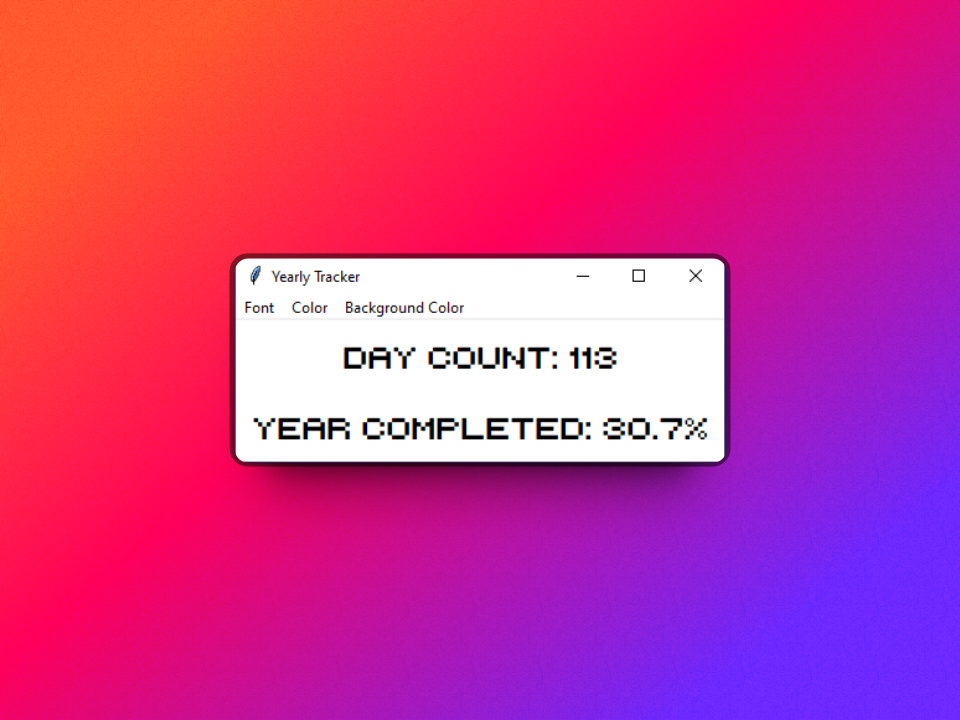

# TrackYear 📅

Introducing our innovative app that helps you track the progress of the year by displaying the percentage completed and the current day count, with the added bonus of customizable options to make your experience unique and personalized. Made with Python, our app is reliable and user-friendly, allowing you to stay on top of your goals and accomplishments with ease.

Download Now: Files Attached to Repository
> :warning: **You are viewing the old version**: [Version 2 is out now!](https://github.com/SarthakChoyal/Yearly-Tracker-V2/tree/main)

## How to use

Download the installer and run the app. (File located in C:\Users\"Username"\Programfiles\Sarthak-Enterprises)

## Screenshots

## Acknowledgements

 - [Youtube Channel](https://www.youtube.com/@SarthakChoyal?sub_confirmation=1)
 - Created by Sarthak Choyal
 - If there are any issues join our [Discord Server](https://discord.gg/GAJe275wBH)
## Optimizations

- Currently only supports Windows 10/11

